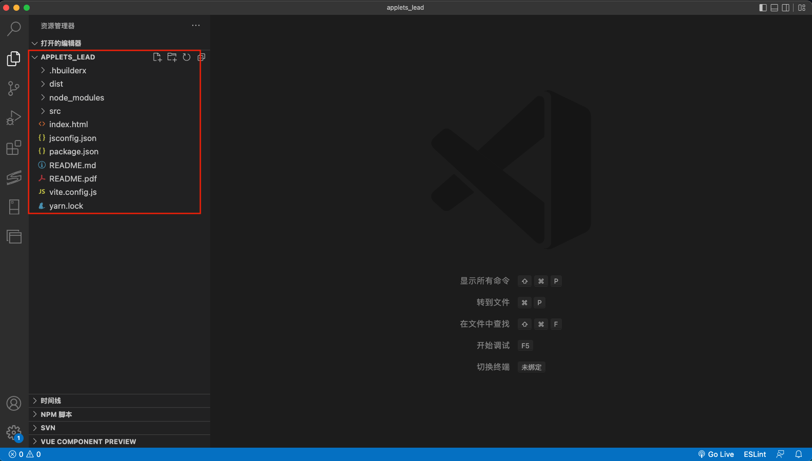
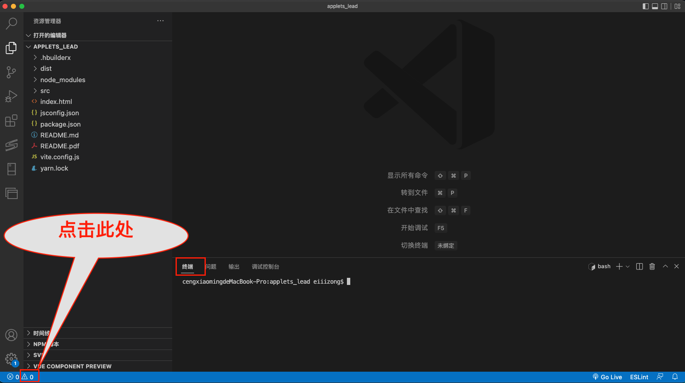
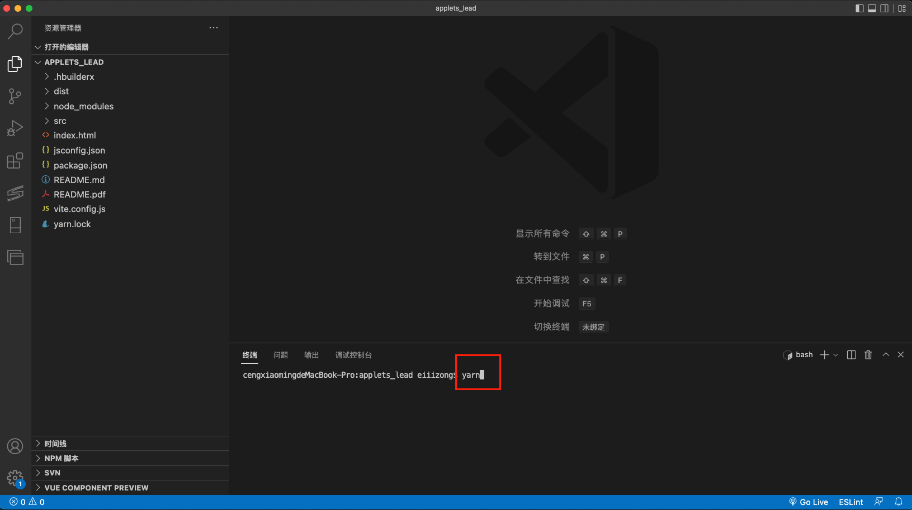
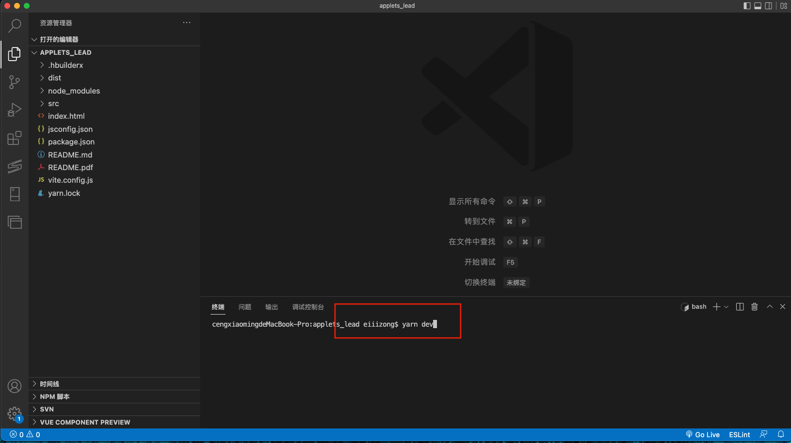
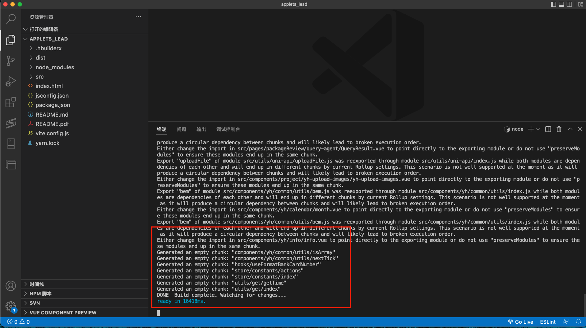
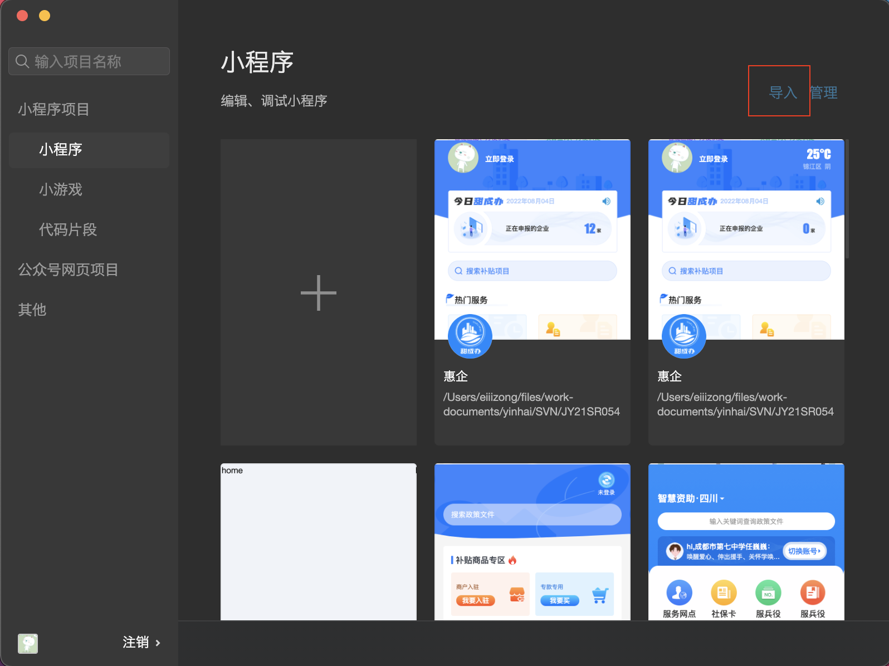
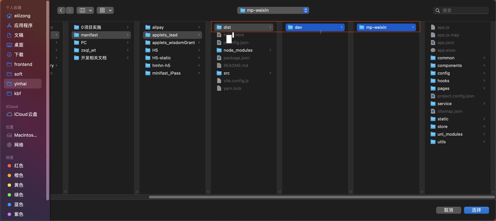
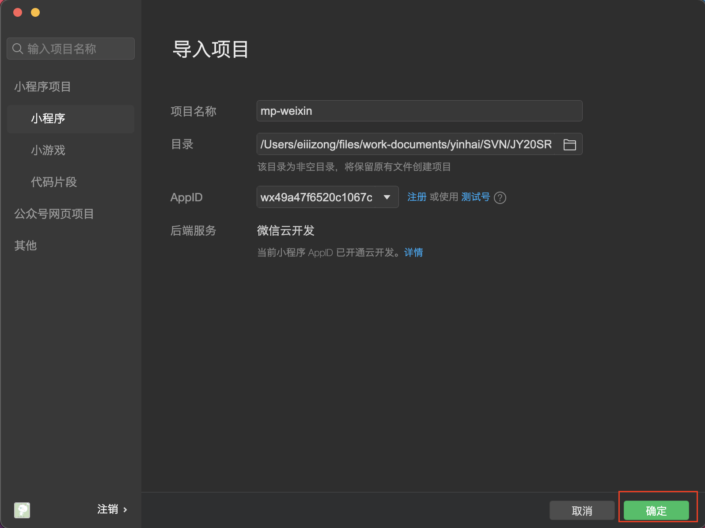
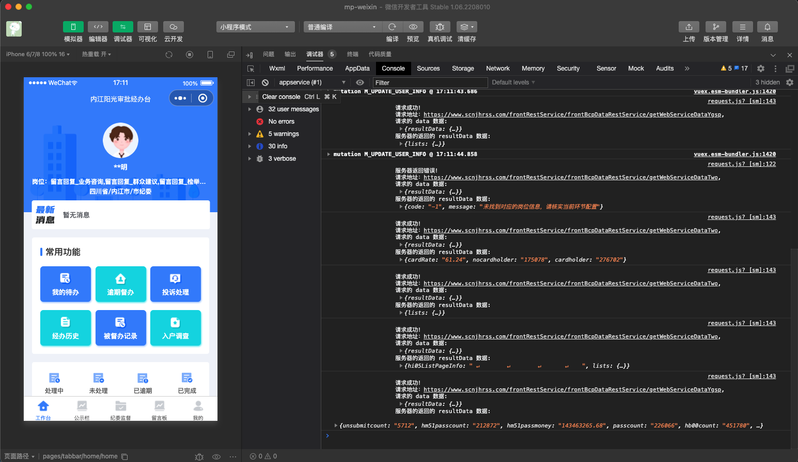

## 微信小程序项目运行说明文档

### 1、检查必备软件

- **VSCode**：[VSCode 下载地址](https://code.visualstudio.com/)

* **Node.js** ：版本需大于 **`14.0.0`**。

```bash
# 检测 node 是否安装以及已安装版本（windows通过cmd运行，Mac通过终端运行，以下所有命令同理）
$ node -v
```

[NVM 安装 nodejs 的方法](https://blog.csdn.net/sinat_23958625/article/details/86491282)

[Node.js 下载地址](http://nodejs.cn/download/)


### 2、将项目在 `VSCode` 中打开




### 3、打开终端

如下图所示：




### 4、安装项目依赖（首次启动需要）

使用 `npm`：

```bash
# 安装项目依赖
$ npm install
```

或者 `yarn`：

```bash
# 安装项目依赖
$ yarn
```

如下图所示：



此处使用的是： <b style="color:#f00">yarn</b>。

输入 `yarn` 之后 `回车` 执行命令。


### 5、运行项目

使用 `npm`：

```bash
# 运行项目
$ npm run dev
```

或者 `yarn`：

```bash
# 运行项目
$ yarn dev
```

如下图所示：



此处使用的是： <b style="color:#f00">yarn dev</b>

输入 `yarn dev` 之后 `回车` 执行命令。

如下图所示表示运行成功：




### 6、启动微信小程序



点击 <b style="color:#f00">导入</b>



选中文件夹 `./dist/dev/mp-weixin ` 点击 <b style="color:#f00">选择</b>



点击 <b style="color:#f00">确定</b>



<b style="color:#f00">如上图表示启动成功</b>
